# Level Mix Summary by Client: Detailed Automation Graph

Legend:
- Square node = workbook, worksheet, worksheet section, column region, or staged dataset
- Circle node = filter, split, normalize, append, write, lookup, assemble, or validation action
- Directed edge = required data dependency or write dependency

```mermaid
flowchart TB
    subgraph staffingWorkbook["FinOps Staffing Sheet 2026 workbook"]
        knownJoinersTab["TA Known Joiners worksheet"]
        openPositionsTab["TA Open Positions worksheet"]
        businessPartnerExitsTab["BP Exits worksheet"]
    end

    subgraph employeeRosterWorkbook["Employee Roster March 2026 workbook"]
        rosterFormatTab["Roster Format worksheet"]
    end

    subgraph rosterMappingWorkbook["Roster Mapping for Group Lead workbook"]
        exitsAppendArea["Yellow exits processing area beginning at row 5, currently populated through about row 389, and treated as append-only"]
        rosterSheetSection["Roster worksheet region placed after the exits processing area, with four to five blank spacer rows left in between"]
        updatedRosterMappingWorkbook["Updated Roster Mapping for Group Lead workbook"]
    end

    subgraph profitAndLossWorkbook["Year-to-Date March 2026 Profit and Loss workbook ('YTD March 26 P&L')"]
        fullTimeEquivalentCostTab["Full-Time-Equivalent Cost worksheet ('FTE Cost')"]
        fullTimeEquivalentAllocationsTab["Full-Time-Equivalent Allocations worksheet ('FTE Allocations')"]
    end

    subgraph previousMonthWorkbook["Previous month Level Mix Summary by Client workbook"]
        previousMonthJanuaryAndFebruaryLevels["Previous month values for Level Jan and Level Feb"]
    end

    subgraph outputWorkbook["March 2026 Level Mix Summary by Client output workbook"]
        staffingSummaryDataTab["Staffing Summary Data worksheet ('SS Data')"]
        clientComparisonTab["Client comparison worksheet ('CMP H by Client'), with only columns AT through DK allowed to change"]
        baseFullTimeEquivalentDataTab["Full-Time-Equivalent Data worksheet ('FTE Data') after loading rows from FTE Allocations"]
        levelColumnsRegion["Full-Time-Equivalent Data worksheet columns Z through AK, containing Level Jan through Level December"]
        currentMonthLevelMarchColumn["Level March column for the March 2026 run"]
        groupLeadColumnRegion["Full-Time-Equivalent Data worksheet column I, containing FinOp Cube Group Lead"]
        completedFullTimeEquivalentDataTab["Completed Full-Time-Equivalent Data worksheet after prior-month carry-forward, current-month level update, and group lead update"]
        validatedOutputWorkbook["Validated March 2026 output workbook"]
    end

    knownJoinersPeriodFilteredRows["TA Known Joiners rows where Period equals 2026"]
    knownJoinersReadyRows["TA Known Joiners rows where Period equals 2026 and Status is not Offer Declined"]
    openPositionsReadyRows["TA Open Positions rows where Period equals 2026"]
    businessPartnerExitsReadyRows["BP Exits rows where Period equals 2026"]
    staffingPayload["Staffing payload containing only the columns needed by the output workbook"]

    rosterDepartmentFilteredRows["Roster Format rows where Primary Department equals Financial Operations"]
    rosterDepartmentAndLocationFilteredRows["Roster Format rows where Primary Department equals Financial Operations and Location is BLR, GGM, or HYD"]
    redFontExitRows["Red-font exit rows from the bottom of the filtered Roster Format worksheet"]
    remainingRosterRows["Filtered Roster Format rows excluding the red-font exit rows"]
    currentMonthLevelRawValues["Current-month level values from the current Employee Roster workbook, matched by Login"]
    currentMonthLevelSuffixValues["Current-month level values normalized to suffixes only, such as L1, L2, Intern, or Contractor"]

    fullTimeEquivalentCostReadyRows["Full-Time-Equivalent Cost rows where Department equals FinOps"]
    clientComparisonPayload["Payload for Client comparison worksheet columns AT through DK"]

    fullTimeEquivalentReadyRows["Full-Time-Equivalent Allocation rows where Department equals Financial Operations or FinOps"]
    loadedFullTimeEquivalentRows["Rows loaded into the output Full-Time-Equivalent Data worksheet"]
    januaryAndFebruaryCarryForwardValues["Previous month carry-forward values for Level Jan and Level Feb"]
    loginToGroupLeadMapping["Login-to-group-lead mapping from the updated Roster Mapping workbook, using Login column G and Group Lead column N"]

    filterKnownJoinersByPeriod(("Filter TA Known Joiners so Period equals 2026"))
    excludeOfferDeclinedRows(("Within the filtered TA Known Joiners rows, remove rows where Status equals Offer Declined"))
    filterOpenPositionsByPeriod(("Filter TA Open Positions so Period equals 2026"))
    filterBusinessPartnerExitsByPeriod(("Filter BP Exits so Period equals 2026"))
    combineStaffingSources(("Combine the three staffing source datasets and keep only the columns required by the output workbook"))
    writeStaffingSummaryData(("Write the staffing payload into the Staffing Summary Data worksheet"))

    filterFullTimeEquivalentCostByDepartment(("Filter the Full-Time-Equivalent Cost worksheet so Department equals FinOps"))
    keepClientComparisonColumns(("Keep the data needed for the Client comparison worksheet and target only columns AT through DK"))
    writeClientComparisonData(("Write the prepared payload into the Client comparison worksheet, columns AT through DK only"))

    filterRosterByDepartment(("Filter the Roster Format worksheet so Primary Department equals Financial Operations"))
    filterRosterByLocation(("Within the department-filtered rows, keep only locations BLR, GGM, and HYD"))
    separateRedFontExits(("Separate the red-font exit rows from the remaining roster rows"))
    extractCurrentMonthLevelValues(("From the filtered current-month Employee Roster rows, extract the level-related values using Login"))
    normalizeCurrentMonthLevelSuffix(("Normalize the current-month level values by keeping only the suffix, such as L1, L2, Intern, or Contractor, and ignoring number components such as 701"))
    findNextAvailableExitRow(("Inspect the yellow exits processing area and find the next available append position without overwriting existing exit rows"))
    appendExitsToYellowSection(("Append the red-font exit rows after the current last populated exit row in the yellow exits processing area"))
    placeRosterStartAfterSpacerRows(("After the appended exits block, leave four to five blank spacer rows and determine the starting position for the remaining roster rows"))
    writeRemainingRosterRows(("Write the remaining roster rows into the Roster worksheet at the dynamically determined start position after the spacer rows"))
    preserveCalculatedGroupLeadColumn(("Do not overwrite formula-based column N; allow the Group Lead formulas to calculate"))
    finalizeRosterMappingWorkbook(("Finalize the updated Roster Mapping workbook for downstream lookup use"))

    filterFullTimeEquivalentAllocationsByDepartment(("Filter the Full-Time-Equivalent Allocations worksheet so Department equals Financial Operations or FinOps"))
    loadBaseFullTimeEquivalentData(("Load all filtered Full-Time-Equivalent Allocation rows into the output Full-Time-Equivalent Data worksheet"))
    identifyLevelColumns(("Identify output columns Z through AK as the Level Jan through Level December region"))
    extractPreviousMonthJanuaryAndFebruaryLevels(("Extract the previous month's Level Jan and Level Feb values for carry-forward"))
    writeJanuaryAndFebruaryCarryForward(("Write the carried-forward Level Jan and Level Feb values into the Level Jan and Level Feb positions of the output workbook"))
    writeCurrentMonthLevelMarch(("Write the normalized current-month level values into the Level March column of the output workbook"))
    buildLoginToGroupLeadMapping(("Read the updated Roster Mapping workbook and build a Login-to-Group-Lead mapping using Login column G and Group Lead column N"))
    updateGroupLeadColumn(("Update output Full-Time-Equivalent Data worksheet column I with FinOp Cube Group Lead values"))
    assembleCompletedFullTimeEquivalentTab(("Assemble the completed Full-Time-Equivalent Data worksheet from the loaded rows, prior-month carry-forward values, current-month Level March values, and updated Group Lead column"))
    validateProtectedWriteScope(("Validate that only Staffing Summary Data, Full-Time-Equivalent Data, and Client comparison columns AT through DK were changed, and that pivot tables and formulas in other output worksheets were not overwritten"))

    knownJoinersTab --> filterKnownJoinersByPeriod --> knownJoinersPeriodFilteredRows --> excludeOfferDeclinedRows --> knownJoinersReadyRows
    openPositionsTab --> filterOpenPositionsByPeriod --> openPositionsReadyRows
    businessPartnerExitsTab --> filterBusinessPartnerExitsByPeriod --> businessPartnerExitsReadyRows
    knownJoinersReadyRows --> combineStaffingSources
    openPositionsReadyRows --> combineStaffingSources
    businessPartnerExitsReadyRows --> combineStaffingSources --> staffingPayload --> writeStaffingSummaryData --> staffingSummaryDataTab

    fullTimeEquivalentCostTab --> filterFullTimeEquivalentCostByDepartment --> fullTimeEquivalentCostReadyRows --> keepClientComparisonColumns --> clientComparisonPayload --> writeClientComparisonData --> clientComparisonTab

    rosterFormatTab --> filterRosterByDepartment --> rosterDepartmentFilteredRows --> filterRosterByLocation --> rosterDepartmentAndLocationFilteredRows --> separateRedFontExits
    rosterDepartmentAndLocationFilteredRows --> extractCurrentMonthLevelValues --> currentMonthLevelRawValues --> normalizeCurrentMonthLevelSuffix --> currentMonthLevelSuffixValues
    separateRedFontExits --> redFontExitRows --> findNextAvailableExitRow --> appendExitsToYellowSection --> exitsAppendArea
    exitsAppendArea --> placeRosterStartAfterSpacerRows --> writeRemainingRosterRows
    separateRedFontExits --> remainingRosterRows --> writeRemainingRosterRows --> rosterSheetSection --> preserveCalculatedGroupLeadColumn
    exitsAppendArea --> finalizeRosterMappingWorkbook --> updatedRosterMappingWorkbook
    preserveCalculatedGroupLeadColumn --> finalizeRosterMappingWorkbook

    fullTimeEquivalentAllocationsTab --> filterFullTimeEquivalentAllocationsByDepartment --> fullTimeEquivalentReadyRows --> loadBaseFullTimeEquivalentData --> loadedFullTimeEquivalentRows --> baseFullTimeEquivalentDataTab
    baseFullTimeEquivalentDataTab --> identifyLevelColumns --> levelColumnsRegion
    previousMonthJanuaryAndFebruaryLevels --> extractPreviousMonthJanuaryAndFebruaryLevels --> januaryAndFebruaryCarryForwardValues --> writeJanuaryAndFebruaryCarryForward --> levelColumnsRegion
    currentMonthLevelSuffixValues --> writeCurrentMonthLevelMarch --> currentMonthLevelMarchColumn
    updatedRosterMappingWorkbook --> buildLoginToGroupLeadMapping --> loginToGroupLeadMapping --> updateGroupLeadColumn --> groupLeadColumnRegion
    loadedFullTimeEquivalentRows --> writeCurrentMonthLevelMarch
    loadedFullTimeEquivalentRows --> updateGroupLeadColumn
    baseFullTimeEquivalentDataTab --> assembleCompletedFullTimeEquivalentTab --> completedFullTimeEquivalentDataTab
    levelColumnsRegion --> assembleCompletedFullTimeEquivalentTab
    currentMonthLevelMarchColumn --> assembleCompletedFullTimeEquivalentTab
    groupLeadColumnRegion --> assembleCompletedFullTimeEquivalentTab

    staffingSummaryDataTab --> validateProtectedWriteScope --> validatedOutputWorkbook
    clientComparisonTab --> validateProtectedWriteScope
    completedFullTimeEquivalentDataTab --> validateProtectedWriteScope
```

## Deterministic Execution Order

Use the graph as a dependency graph, but run it with a fixed traversal policy so the automation behaves the same way every month.

Traversal rule:
- Traverse in topological order.
- When multiple branches are ready at the same time, use this stable branch order:
- Update the Roster Mapping workbook and stage the current-month level values first.
- Prepare the Staffing Summary Data payload second.
- Prepare the Client comparison payload from the Full-Time-Equivalent Cost worksheet third.
- Load and enrich the Full-Time-Equivalent Data worksheet fourth.
- Validate and save the output workbook last.

Why this order is reliable:
- The updated Roster Mapping workbook is needed before the Login-to-Group-Lead mapping can be built.
- The filtered current Employee Roster dataset is also the source for the current-month Level March update, so it is efficient and unambiguous to stage that mapping during the same branch.
- The prior-month carry-forward, the current-month Level March update, and the Group Lead enrichment all depend on the base Full-Time-Equivalent Data load already existing in the output workbook.
- The Staffing Summary Data update and the Client comparison update are independent of the Group Lead logic, so they can be staged separately, but they should still be committed in a fixed order.
- Final validation must happen only after all three allowed output targets are ready.

Execution barriers:
- Barrier 1: the filtered current Employee Roster rows must exist before the current-month level values can be extracted and normalized.
- Barrier 2: the updated Roster Mapping workbook must exist before the Login-to-Group-Lead mapping is built.
- Barrier 3: the base Full-Time-Equivalent Data load must exist before the prior-month carry-forward is written.
- Barrier 4: the base Full-Time-Equivalent Data load must exist before Level March is updated from the current Employee Roster workbook.
- Barrier 5: the remaining roster rows cannot be written until the exits append position has been resolved and the four-to-five-row spacer has been applied.
- Barrier 6: the base Full-Time-Equivalent Data load must exist before output column I is updated with Group Lead values.
- Barrier 7: Staffing Summary Data, Client comparison, and the completed Full-Time-Equivalent Data worksheet must all exist before final validation.

Exact compute order for code:
1. Validate that every required workbook, worksheet, worksheet section, column region, and write range exists.
2. Read the Employee Roster March 2026 workbook and filter the Roster Format worksheet by Primary Department equals Financial Operations.
3. From those department-filtered rows, keep only locations BLR, GGM, and HYD.
4. Split the filtered current-month roster rows into red-font exit rows and remaining roster rows.
5. From the same filtered current-month roster rows, extract the level-related values based on Login and normalize them so only suffix-style level values remain, such as L1, L2, Intern, or Contractor, while ignoring number components such as 701.
6. Inspect the yellow exits processing area in the Roster Mapping workbook, determine the next available append position, and append the red-font exit rows without overwriting existing exit rows.
7. After the appended exits block, leave four to five blank spacer rows and determine the starting position for the remaining roster rows.
8. Write the remaining roster rows into the Roster worksheet at that dynamically determined start position, while preserving formula-based column N.
9. Finalize and save the updated Roster Mapping workbook.
10. Read the FinOps Staffing Sheet 2026 workbook and prepare the Staffing Summary Data payload:
11. Filter TA Known Joiners for Period equals 2026.
12. Remove rows where Status equals Offer Declined.
13. Filter TA Open Positions for Period equals 2026.
14. Filter BP Exits for Period equals 2026.
15. Combine the three filtered staffing datasets and keep only the columns required by the output workbook.
16. Read the Year-to-Date March 2026 Profit and Loss workbook and prepare the Client comparison payload by filtering the Full-Time-Equivalent Cost worksheet where Department equals FinOps and keeping only the data meant for columns AT through DK.
17. Read the Full-Time-Equivalent Allocations worksheet from the same Profit and Loss workbook and filter rows where Department equals Financial Operations or FinOps.
18. Load all filtered Full-Time-Equivalent Allocation rows into the Full-Time-Equivalent Data worksheet.
19. Identify columns Z through AK in that worksheet as the Level Jan through Level December region.
20. Read the previous month's Level Mix Summary by Client workbook and extract the Level Jan and Level Feb values needed for carry-forward.
21. Write those carried-forward Level Jan and Level Feb values into the current output workbook.
22. Write the normalized current-month level values from the Employee Roster workbook into the Level March column of the current output workbook.
23. Build a Login-to-Group-Lead mapping from the updated Roster Mapping workbook using Login column G and Group Lead column N.
24. Update column I of the Full-Time-Equivalent Data worksheet with FinOp Cube Group Lead values based on Login.
25. Assemble the completed Full-Time-Equivalent Data worksheet state.
26. Commit output writes in this fixed order: Staffing Summary Data worksheet first, Client comparison worksheet columns AT through DK second, and Full-Time-Equivalent Data worksheet third.
27. Validate that only the permitted output regions changed and that pivot tables and formulas in other output worksheets were preserved.
28. Save the March 2026 output workbook.

Preferred implementation model:
- Do not stream workbook-to-workbook edits one cell at a time while traversing the graph.
- First compute each staged dataset as an in-memory payload or isolated worksheet buffer.
- Then commit the staged payloads into the destination workbook in the fixed write order above.
- Treat the yellow exits processing area as append-only for exit rows that are already present.
- Treat the placement of the remaining roster rows as relative to the exits block, not as a fixed row number.
- This reduces ambiguity, avoids partial updates, and makes the final validation step meaningful.

Execution-order view:

```mermaid
flowchart TD
    validateInputs["Validate every required workbook, worksheet, section, column region, and write range"]
    buildRosterMappingAndLevelStaging["Build and save the updated Roster Mapping workbook and stage current-month level values from Employee Roster"]
    prepareStaffingSummary["Prepare the Staffing Summary Data payload from the staffing workbook"]
    prepareClientComparison["Prepare the Client comparison payload from the Full-Time-Equivalent Cost worksheet"]
    loadBaseFullTimeEquivalentDataStep["Load the base Full-Time-Equivalent Data rows from the Full-Time-Equivalent Allocations worksheet"]
    carryForwardPriorMonthLevels["Carry forward Level Jan and Level Feb from the previous month's workbook"]
    writeCurrentMonthMarchLevel["Write Level March from the current Employee Roster workbook"]
    updateGroupLeadValues["Update Full-Time-Equivalent Data worksheet column I using the updated Roster Mapping workbook"]
    assembleFullTimeEquivalentTab["Assemble the completed Full-Time-Equivalent Data worksheet"]
    commitStaffingSummary["Commit the Staffing Summary Data worksheet"]
    commitClientComparison["Commit Client comparison columns AT through DK"]
    commitFullTimeEquivalentData["Commit the Full-Time-Equivalent Data worksheet"]
    validateAndSave["Validate protected write scope and save the output workbook"]

    validateInputs --> buildRosterMappingAndLevelStaging --> prepareStaffingSummary --> prepareClientComparison --> loadBaseFullTimeEquivalentDataStep --> carryForwardPriorMonthLevels --> writeCurrentMonthMarchLevel --> updateGroupLeadValues --> assembleFullTimeEquivalentTab --> commitStaffingSummary --> commitClientComparison --> commitFullTimeEquivalentData --> validateAndSave
```

## Coverage Check Against Canonical Source Instructions

Canonical source file:
- [original-level-mix-instructions.md](/Users/nuppalap/Desktop/automate/original-level-mix-instructions.md)

Line-by-line coverage:
- Line 1 is represented by the overall March 2026 output workbook and run-specific execution order.
- Line 3 is represented by the statement that there are four operational workbooks in the flow.
- Line 4 is represented by the FinOps Staffing Sheet 2026 workbook branch.
- Line 5 is represented by the Employee Roster March 2026 workbook branch.
- Line 6 is represented by the Roster Mapping for Group Lead workbook branch.
- Line 7 is represented by the Year-to-Date March 2026 Profit and Loss workbook branch.
- Line 9 is represented by the previous month Level Mix Summary by Client workbook branch used for prior-month carry-forward.
- Line 11 is represented by the branch that reads Employee Roster March 2026, updates the Roster Mapping for Group Lead workbook, finalizes that workbook, and later uses it to update the output workbook's Group Lead column.
- Line 13 is represented by the staffing branch for TA Known Joiners, TA Open Positions, and BP Exits.
- Line 14 is represented by the Period equals 2026 filters, the exclusion of Offer Declined rows, the combination of the three staffing datasets, the instruction to keep only necessary columns, and the final write into the Staffing Summary Data worksheet.
- Line 16 is represented by the Full-Time-Equivalent Cost branch.
- Line 17 is represented by filtering the Full-Time-Equivalent Cost worksheet where Department equals FinOps and writing only to the Client comparison worksheet columns AT through DK.
- Line 19 is represented by the full Employee Roster to Roster Mapping branch.
- Line 20 is represented by reading the Roster Format worksheet, filtering Primary Department to Financial Operations, and filtering Location to BLR, GGM, and HYD.
- Line 22 is represented by detecting the red-font exits, treating the yellow exits area as append-only, finding the next available append position, and appending new exit rows without overwriting existing exit rows.
- Line 24 is represented by placing the remaining roster rows after the exits block with a four-to-five-row spacer and preserving the formula-based Group Lead column N.
- Line 26 is represented by the full Full-Time-Equivalent Data branch.
- Line 27 is represented by filtering the Full-Time-Equivalent Allocations worksheet for Department equals Financial Operations or FinOps and loading all filtered rows into the Full-Time-Equivalent Data worksheet.
- Line 29 is represented by identifying columns Z through AK as the Level Jan through Level December region and carrying forward the previous month's Level Jan and Level Feb values into the current output workbook.
- Line 31 is represented by extracting current-month level data from the Employee Roster workbook based on Login, normalizing the values to suffix-only level values, and writing those values into the Level March column.
- Line 33 is represented by building the Login-to-Group-Lead mapping from Login column G to Group Lead column N in the updated Roster Mapping workbook and then using that mapping to update column I of the Full-Time-Equivalent Data worksheet.
- Line 35 is represented by the final constraints section.
- Line 36 is represented by the final validation rule that only Staffing Summary Data, Full-Time-Equivalent Data, and Client comparison columns AT through DK may change, while pivot tables and formulas in other output worksheets remain untouched.

Current sync verdict:
- The graph now captures every non-empty instruction line in the canonical source file.
- The graph now also captures the three corrections added after the first draft: the Full-Time-Equivalent Cost worksheet name, append-only handling for existing exit rows, and current-month Level March updates from the current Employee Roster workbook.

## Future Generalization Note

When the actual Excel workbook files are available in project context, revise the temporary hard-coded layout anchors in this graph using the workflow guidance saved in:
- [excel-layout-generalization-guidance.md](/Users/nuppalap/Desktop/automate/excel-layout-generalization-guidance.md)
